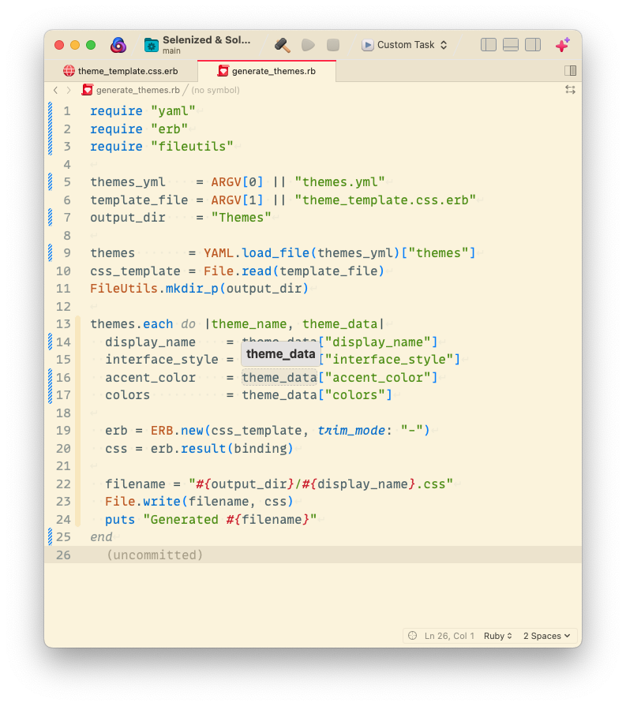
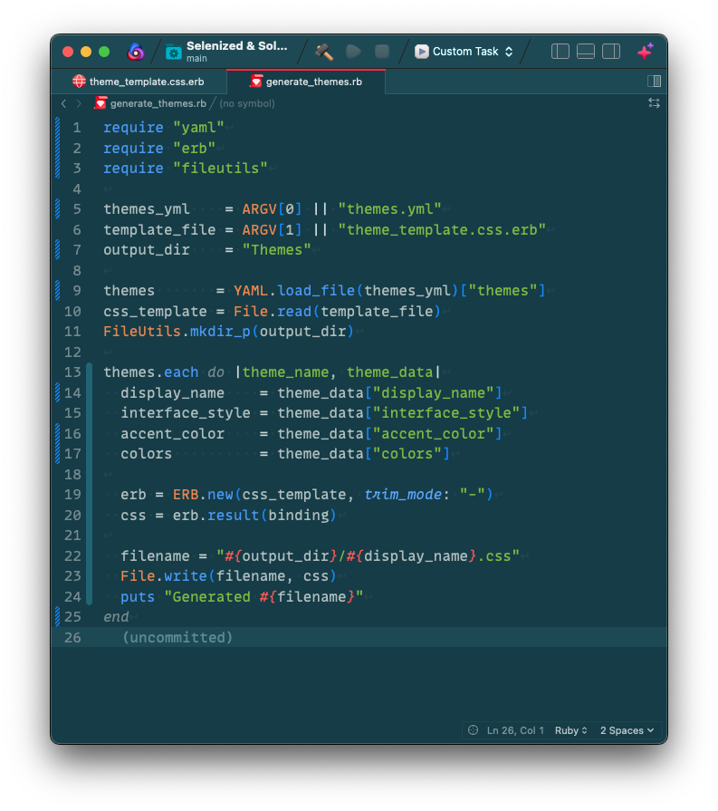
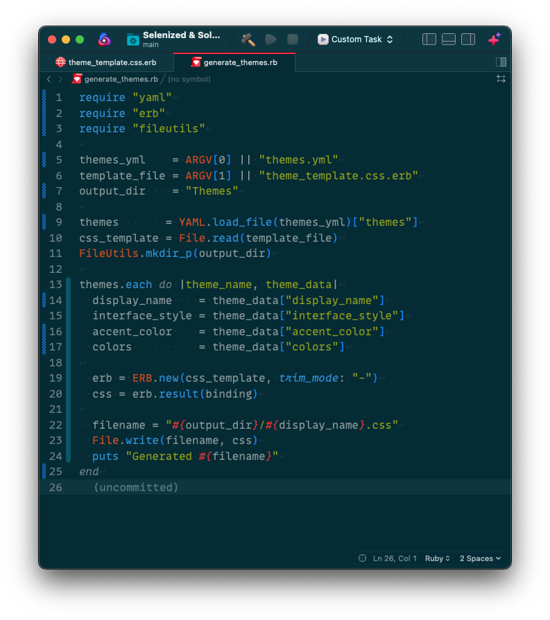

# Selenized & Solarized

This extension provides a set of themes for the Selenized and Solarized colorsets for the Nova editor, with personal color choices and careful mapping for code and UI.

## Theme Previews

Below are previews for each included theme:

### Selenized Light

### Selenized Dark

### Selenized Black

### Selenized White

### Solarized Light

### Solarized Dark

## Acknowledgements

* Selenized (Rails) is based on the _Selenized theme_ by [Jan Warchol](https://github.com/jan-warchol/selenized).
* [Solarized](https://github.com/altercation/solarized) by [Ethan Schoonover](https://ethanschoonover.com)
